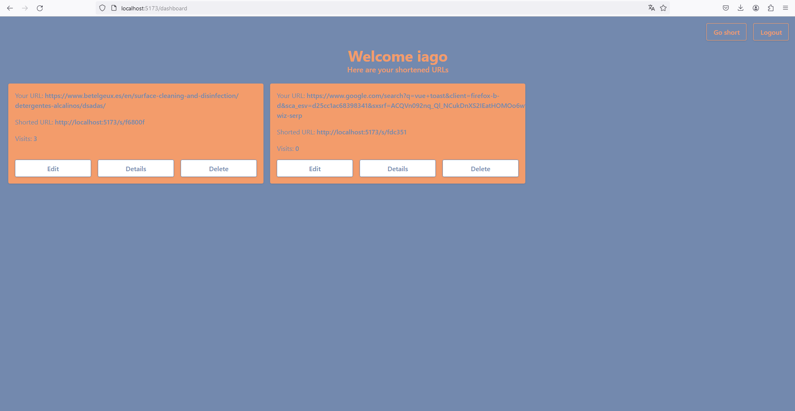

# Prueba Técnica Fitness KPI

Este repositorio es un proyecto creado bajo las especificaciones dadas por "Fitness KPI" a modo de prueba técnica. El objetivo es crear una aplicación capaz de acortar URLs dadas por los usuarios y redireccionar a aquellos que accedan mediante esa URL a la original.

## Tecnologías usadas

El proyecto se divide en dos partes, un backend creado con Laravel y un frontend creado con Vue.js. La idea es que el backend sea una API REST que se encargue de gestionar las URLs y el frontend sea una SPA que se encargue de la interfaz de usuario.

### Librerias del backend

- Laravel 10: https://laravel.com/
- Laravel Sanctum: https://laravel.com/docs/10.x/sanctum
- Laravel Breeze: https://laravel.com/docs/10.x/starter-kits

### Librerias del frontend

- Vue 3: https://v3.vuejs.org/
- Vue Router: https://router.vuejs.org/
- Vite: https://vitejs.dev/
- TailwindCSS: https://tailwindcss.com/
- Axios: https://axios-http.com/
- Pinia: https://pinia.esm.dev/
- GSAP: https://greensock.com/gsap/
- Vue Toast Notification: https://github.com/ankurk91/vue-toast-notification

## Configuración y puesta en marcha

Comienza haciendo un clone del repositorio en la carpeta local que deseas guardarlo. Como requisitos será necesario tener instalado Node y, como recomendación, algún entorno de desarrollo de Laravel (por sencillez lo mejor es usar Laragon), aunque podrías instalar todas las depencias necesarias y configuraciones de PHP con un servidor de PHP como Apache o NGinx si lo deseas.

1. Al tener las carpetas ya en local nos dirigimos a la subcarpeta "backend" para configurar el archivo .env del entorno de Laravel. Puedes usar el .env.example como base.

> [!NOTE]
> A partir de aquí asumiré que se hace uso de Laragon, si estas usando otro entorno deberás buscar lo equivalente.

2.  Si usas el entorno de Laragon al completo con MySQL solo necesitarás editar 3 variables del .env

    - APP_URL: La URL de tu servidor local, lo ideal es que uses http://localhost:8000 por algo que explicare mas adelante.

    - FRONTEND_URL: La URL del frontend, la que habitualmente otorga vite es http://localhost:5173 pero si al iniciar el frontend tienes una diferente, esa es la que deberás usar.

    - SESSION_DOMAIN: La URL base del proyecto, en local siempre deberia ser localhost salvo casos en los que uses Virtual Hosts

3.  Para poder empezar a poner Laravel a funcionar debemos primero instalar todas las dependencias de composer, ejecutar `php artisan key:generate ` para tener nuestra clave y por último ejecutar las migraciones con `php artisan migrate` para tener la base de datos. Una vez ejecutados estos comandos mi recomendación es usar `php artisan serve`, esto generara un servidor en el puerto 8000 al que podremos acceder con localhost, la idea de esto es evitar "magia" que hace Laragon por detrás que genera problemas de CORS por la diferencia de hosts.

4.  Para ejecutar nuestro frontend solo deberás instalar las dependencias de npm en la subcarpeta frontend, ubicada en la raiz del proyecto, y ejecutar `npm run dev`, en la consola aparecerá el puerto de escucha (el que deberás especificar en el .env del paso dos).

## Uso de la aplicación

Al entrar por primera vez veremos una pantalla de inicio con un formulario para acortar URLs, al introducir una URL y enviarla se nos mostrará una URL acortada que podremos usar para redirigir a la URL original encima del formulario. Los usuarios que acorten URLs y no estén registrados solo podrán visitar dichas URLs un número limitado de veces, si desean tener un control de las URLs acortadas y tener un uso indefinido deberán registrarse.

Al registrarse se les pedirá un nombre de usuario, un email y una contraseña, una vez registrados podrán proceder a loguearse.

Al loguearse se les redirigirá a la página de inicio, pero ahora podrán ver un listado de todas las URLs que han acortado y el número de veces que han sido visitadas al entrar en el apartado Dashboard del usuario, además de disfrutar de acceso ilimitado a los links.

